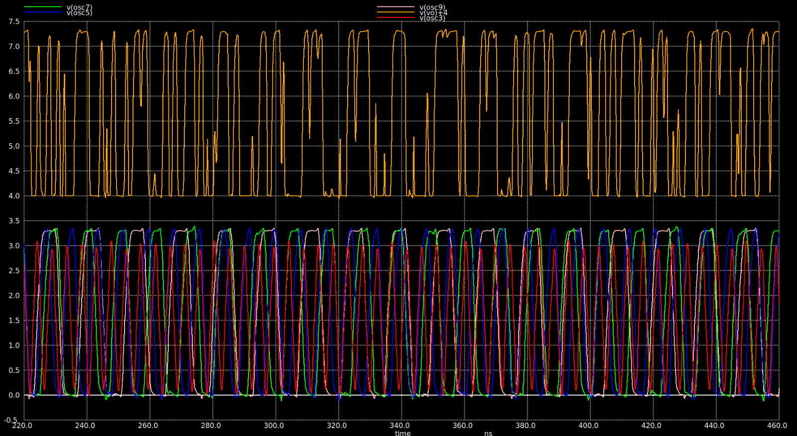
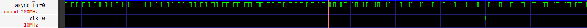
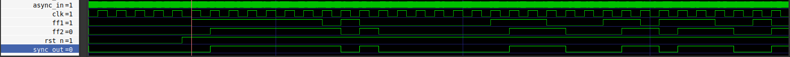
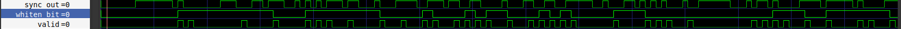
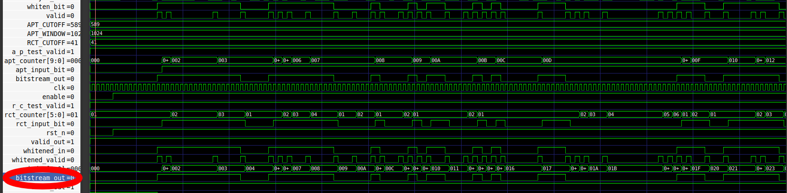
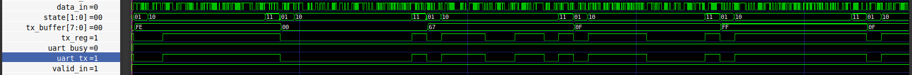

# Ring Oscillator Based True Random Number Generator With Built-In Self Test

## 1. Project Information
* **Track:** A
* **Team:** A53 IRIS Labs Hardware
* **Lead:** @adulu-bang (NITK, Surathkal - Senior Undergrad)
* **Member:** @Adithya1435 (NITK, Surathkal - Senior Undergrad)
* **Member:** @shamithoysal (NITK, Surathkal - Junior Undergrad)
* **Member:** @ChetanSK7 (NITK, Surathkal - Junior Undergrad)
* **Member:** @PDK34 (NITK, Surathkal - Junior Undergrad)
* **Member:** @krishmehta5760-design (NITK, Surathkal - Junior Undergrad)
* **Member:** @Vishva2006chavada (NITK, Surathkal - Junior Undergrad)
* **Project Tracker:** [Tracker Sheet](https://docs.google.com/spreadsheets/d/1-ozuuI4A2vr-vA2QuO2DlhXjDHzm8IHm-ncEqCDuqfo/edit?gid=0#gid=0)

## 2. Design Objectives
Implement a secure True Random Number Generator (TRNG) on GF180MCU using thermal noise-induced jitter, providing validated entropy with automatic hardware interrupts upon statistical failure.

**Target Specifications:**
* **Supply Voltage:** 3.3V
* **Throughput:** ~2.5 Mbps (Whitened)
* **Features:** NIST-compliant health monitoring, UART with Valid interface
* **Area Constraints:** Comfortably within Block D constraints (< 312,000 µm²)

## 3. System Overview
* **Entropy Source:** Quad-oscillator (Current-Starved Ring Oscillators with 3, 5, 7, and 9 stages).
* **Post-Processing:** Von Neumann hardware whitener to eliminate localized silicon bias.
* **Health Monitoring:** NIST SP 800-90B compliant BIST engine evaluating Repetition Count (RCT) and Adaptive Proportion (APT) for real-time security.
* **Interface:** Parameterizable UART for self-timed serial output.
  
## 4. Architecture & Approach
The core entropy generation relies on driving four parallel ring oscillators into a severely current-starved state to maximize susceptibility to thermal noise (phase jitter). A single master bias voltage (`VinVCO`) controls the global current mirroring network.

Through rigorous transient sweeps and tuning, `VinVCO` was locked at an operating point of 1.05V. This specific biasing ensures the oscillators operate at heavily degraded frequencies (71 MHz – 212 MHz) to accumulate maximum jitter, while retaining just enough slew rate to drive standard cell logic gates without inducing metastability or stray pulses at the XOR combination stage.

The digital backend is built for area efficiency and real-time testing. A 2 flip-flip synchronizer aligns the raw XOR pulses to the system clock. A Von Neumann extractor decimates the bitstream to remove determinism, passing only valid bits to the BIST. The BIST operates dynamically ensuring that if a health check fails, the `valid_out` flag drops, invalidating the bitstream until randomness recovers. A buffering UART state machine absorbs these unpredictable stalls, assembling valid bits into uniform 8-bit payloads for external transmission.

## 5. Synthesis & Verification Results

**Logic Synthesis Footprint (GF180MCU)**

| Module | Logic Type | Cell Count |
| :--- | :--- | :--- |
| **BIST** | Mixed | 125 |
| **UART TX** | Mixed | 102 |
| **Whitener** | Mixed | 7 |
| **Synchronizer** | Sequential | 2 |
| **Total Design** | **Combinational** | **168** |
| **Total Design** | **Sequential (DFFs)** | **68** |
| **Total Design** | **Overall Footprint** | **236** |

**Analog Characterization & Statistical Python Verification**
Simulated over a 100 µs transient run with a 10 MHz sampling frequency yielding 1000 contiguous bits.

**Random Jitter (RJ)** is the unpredictable timing variation of a signal's transition edges, driven by intrinsic physical phenomena like thermal noise within the silicon. It is modeled as a continuous Gaussian distribution and is calculated by measuring the duration of thousands of clock cycles and extracting the standard deviation of those period lengths. In True Random Number Generators, RJ acts as the primary source of entropy. 

| Parameter | Measurement | Target / Ideal |
| --- | --- | --- |
| **Osc3 Frequency** | 212.91 MHz | ~200 MHz |
| **Osc5 Frequency** | 124.27 MHz | < 150 MHz |
| **Osc7 Frequency** | 91.25 MHz | < 100 MHz |
| **Osc9 Frequency** | 71.78 MHz | < 80 MHz |
| **Osc3 Jitter (RJ)** | 71.65 ps | Maximize |
| **Osc5 Jitter (RJ)** | 86.52 ps | Maximize |
| **Osc7 Jitter (RJ)** | 69.17 ps | Maximize |
| **Osc9 Jitter (RJ)** | 89.01 ps | Maximize |
| **Proportion of 1s** | 48.50% | 50.00% |
| **Shannon Entropy** | 0.9994 bits/bit | 1.0000 bits/bit |

## 6. Simulation & Waveforms

* **`RO_out.jpeg`**: Displays the analog transient simulation. The bottom panel traces the four current-starved ring oscillators generating distinct, low-frequency, slew-limited waveforms. The top panel verifies the XOR combination, showing high-slew rail-to-rail (0V to 3.3V) digital transitions achieved via bias tuning.
  
  

* **`s1_input_to_dig_bbox.png`**: Captures the asynchronous raw bitstream entering the digital wrapper from the analog macro boundary.
  
  

* **`s2_output_of_2ff_sync.png`**: Verifies the 2-stage flip-flop synchronizer successfully aligning the unpredictable analog transitions to the primary digital clock domain.
  
  

* **`s3_output_of_whitener.png`**: Demonstrates the Von Neumann extractor eliminating localized bias by converting bit pairs, asserting the `valid` signal only upon successful extractions.
  
  

* **`s4_output_of_bist_after_checks.png`**: Highlights the NIST 800-90B Repetition Count (RCT) and Adaptive Proportion (APT) counters actively evaluating the whitened stream in real-time.
  
  

* **`s5_final_uart_serial_op.png`**: Shows the UART state machine assembling validated bits into 8-bit payloads and successfully transmitting them over the `uart_tx` line, managing asynchronous timing via the `uart_busy` back-pressure flag.
  
  

## 7. Pinout
**Required Pins (10 for Block D):**
1. `VDD` (3.3V)
2. `rst`
3. `clk`
4. `analog_raw_out`
5. `raw_bitstream_out`
6. `vin_vco`
7. `test_data_in`
8. `test_mode_en`
9. `data_serial_out`
10. `bist_flag_out`

## 8. Design Assumptions
* **Process:** GF180MCU
* **Supply Voltages:** 3.3V
* **Temperature Range:** 27°C (Nominal)
* **Process Corners:** Typical (TT)
* **Expected Loads:** Minimal digital gate capacitance

## 9. Verification Status
* **Functional Simulations:** Completed (Analog Transient & Digital RTL)
* **Corner Simulations:** Pending
* **Monte Carlo:** Pending
* **ERC Status:** Pending
* **LVS Status:** Pending
* **DRC Status:** Pending

## 10. Design Checklist
[Tracker Sheet](https://docs.google.com/spreadsheets/d/1-ozuuI4A2vr-vA2QuO2DlhXjDHzm8IHm-ncEqCDuqfo/edit?gid=0#gid=0)

## Appendix
* [Github repo](https://github.com/adulu-bang/chipathon-2026-gf180mcu-padring)
* [Proposal Slide Link](https://docs.google.com/presentation/d/1zyiSy5pXFW7qDK3PnsmIJJ3JKncjwmS0C97lQ60cgV0/edit?usp=sharing)
* [Pin Requirement Link](https://docs.google.com/spreadsheets/d/1vlf4bobqyBpes0OXRo3WkeBfvZ0Q98wy23-1s9zWPs0/edit?usp=sharing)
* [Schematic Review Slide Link](https://docs.google.com/presentation/d/1rMAJ4osuEd0aIzgOALcpXQIVo0k_lUYP_h-90CUlhMc/edit?slide=id.g3f0c3192734_0_200#slide=id.g3f0c3192734_0_200)
## Acknowledgments
This project is built using the Chipathon 2026 GF180MCU Padring wrapper, derived from the `wafer-space/gf180mcu-project-template` and Juan Moya's `padring_gf180`. See `CREDITS.md` and `NOTICE` for full upstream attribution.
